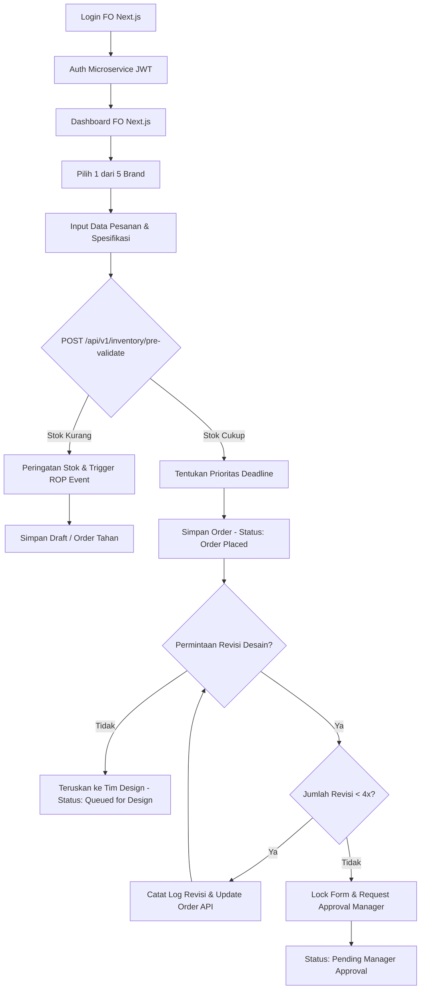
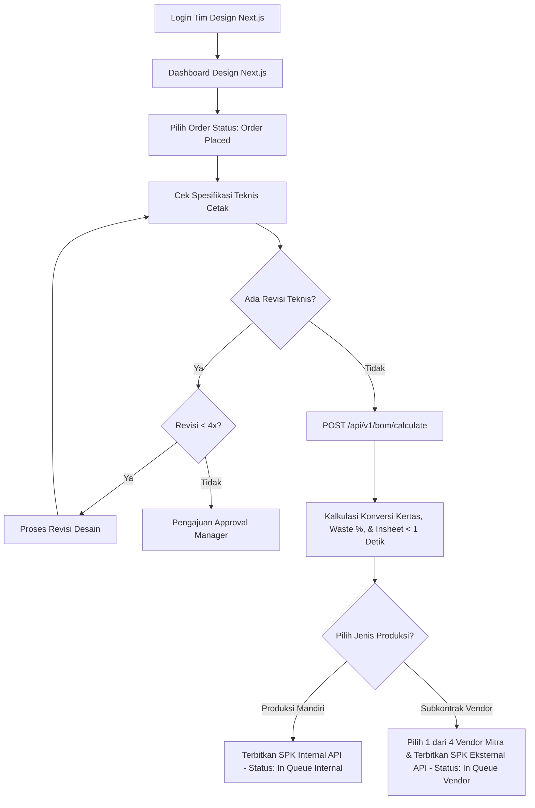
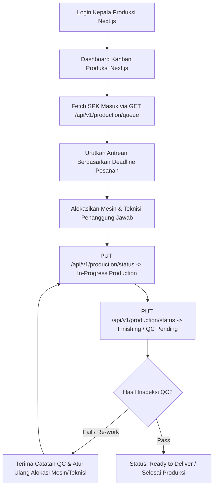
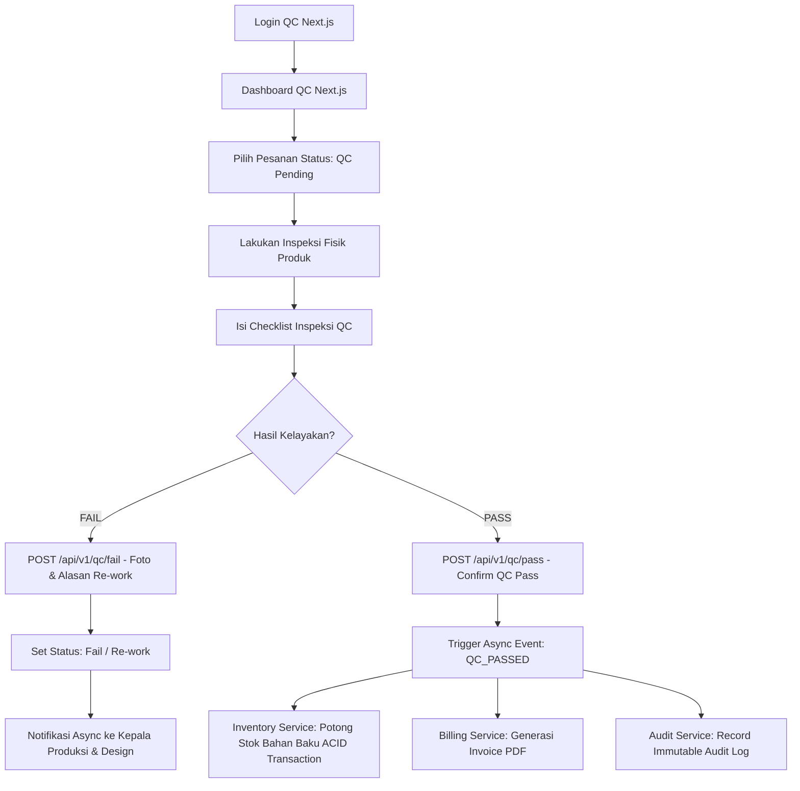
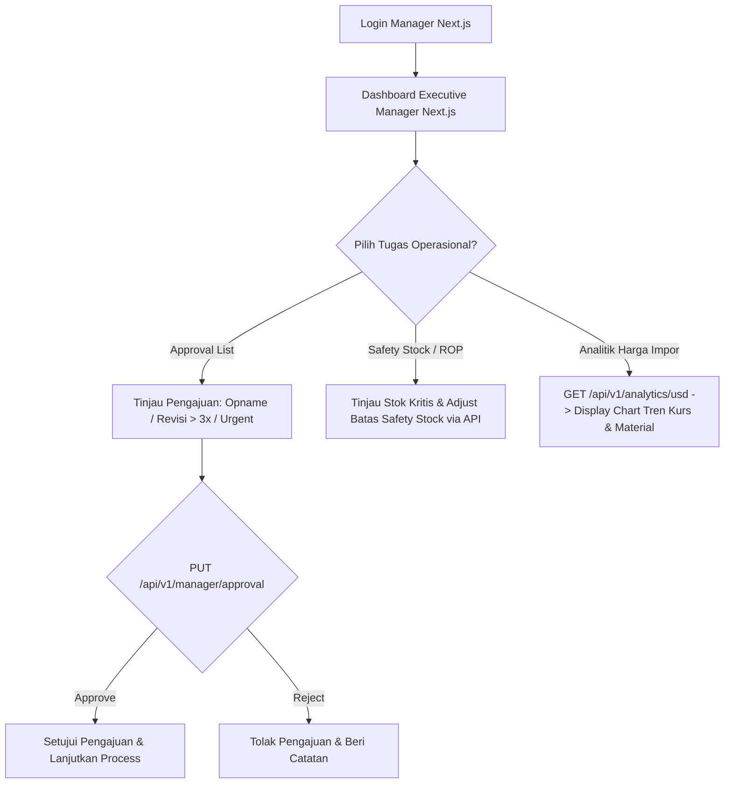
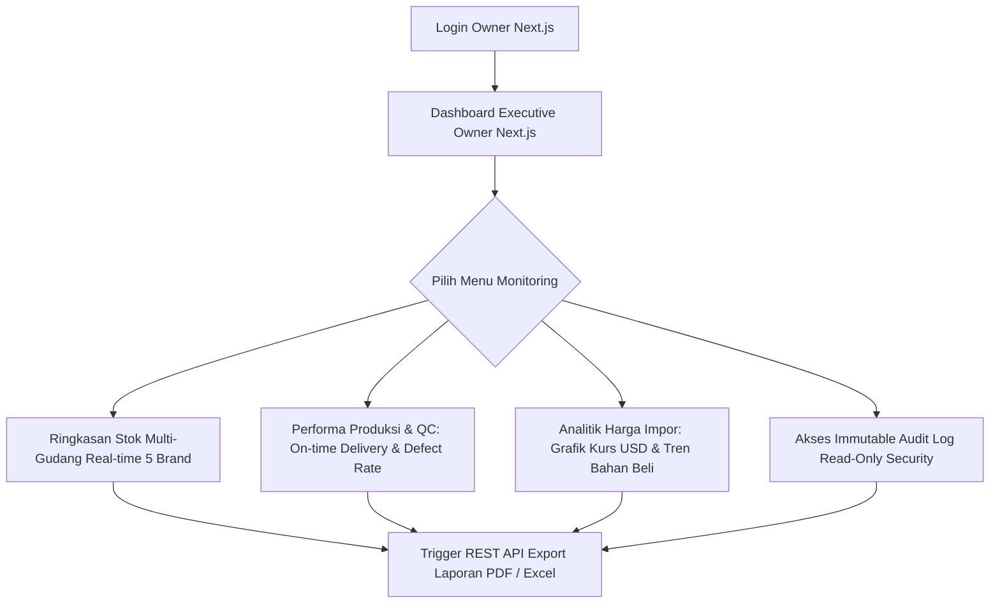

# Dokumentasi Workflow & Flowchart ERP/CRM Percetakan (Microservices & Next.js)

Dokumen ini memuat alur kerja (*workflow*) lengkap, spesifikasi teknis, serta *flowchart* untuk ke-7 *role* pengguna dalam sistem ERP/CRM percetakan dengan arsitektur **Next.js Frontend** dan **Laravel Microservices API**.

---

## Ringkasan Arsitektur Sistem

* **Frontend Framework:** Next.js (App Router, Tailwind CSS, Component-Based UI)
* **Backend Architecture:** Laravel Microservices API Gateway & Independent RESTful Services
* **Database & Persistence:** PostgreSQL (Database-per-Service dengan transaksi ACID & Row Locking)
* **Cakupan Bisnis:** 5 Brand Percetakan (*Packsolution.id, Estella Digital Printing, Pepipapier, memoirs.print, pikpurry*)
* **Cakupan Gudang:** Gudang 1 (Utama) & Gudang 2 (Toko / Ruko)

---

## Daftar Isi
1. [Front Office (FO)](#1-front-office-fo)
2. [Tim Design](#2-tim-design)
3. [Kepala Produksi](#3-kepala-produksi)
4. [Quality Control (QC)](#4-quality-control-qc)
5. [Staf Gudang](#5-staf-gudang)
6. [Manager](#6-manager)
7. [Owner](#7-owner)
8. [Matriks REST API Service & Event Architecture](#8-matriks-rest-api-service--event-architecture)

---

## 1. Front Office (FO)

### 1.1. Ikhtisar Role (Overview)
Role **Front Office (FO)** bertindak sebagai pintu utama (*entry point*) masuknya pesanan pelanggan melalui antarmuka **Next.js FO Dashboard**. FO bertugas mencatat order, memilih brand bisnis, memicu validasi ketersediaan stok via API ke *Inventory Microservice*, mengelola permintaan revisi desain, serta menetapkan prioritas *deadline* sebelum pesanan diteruskan ke divisi teknis (Tim Design).

### 1.2. Hak Akses & Modul Sistem (Next.js FE & API Gateway)
* **Modul UI (Next.js):** FO Dashboard, Order Management Form, Brand Selector, Customer Revision Logs.
* **REST API Service:** Order Intake Microservice (`/api/v1/orders`), Inventory Service (`/api/v1/inventory/pre-validate`).
* **Hak Akses Data:**
  * **Create / Edit:** Pesanan baru (*Order Placed*), data profil pelanggan, catatan revisi (revisi ke-1 hingga ke-3).
  * **Read-Only:** Ringkasan stok gudang (*Pre-Validation API*), status kelanjutan produksi harian.
  * **Restricted:** Tidak dapat melakukan *override* batas revisi (revisi ke-4 dan seterusnya membutuhkan *approval* Manager).

### 1.3. Rincian Alur Kerja (Detailed Workflow)

#### 1.3.1. Autentikasi & Navigasi Utama
1. Pengguna masuk (*login*) pada halaman Next.js menggunakan kredensial akun FO.
2. Next.js mengirimkan kredensial ke **Auth Microservice** via API Gateway, menerima JWT Token, lalu mengarahkan pengguna ke **Dashboard FO**.

#### 1.3.2. Pemilihan Brand & Input Pesanan Baru
1. Pengguna memilih **1 dari 5 Brand** percetakan pada antarmuka Next.js (*Packsolution.id, Estella Digital Printing, Pepipapier, memoirs.print, pikpurry*).
2. Pengguna mengisi formulir pesanan baru:
   * **Data Pelanggan:** Nama, nomor kontak, serta alamat pengiriman.
   * **Spesifikasi Produk:** Jenis material/kertas, dimensi ukuran, jumlah eksemplar/oplak, dan opsi *finishing*.
   * **Lampiran File:** Berkas desain awal yang dikirimkan oleh pelanggan (di-upload ke Storage API).

#### 1.3.3. Stock Pre-Validation Engine (Inter-Service API Call)
Saat formulir diisi, Next.js memanggil endpoint `POST /api/v1/inventory/pre-validate` pada *Inventory Microservice*.

* **Skenario A: Stok Cukup**
  * REST API mengembalikan respons `status: 200 OK (Stock Available)`. Pesanan dilanjutkan ke tahap penentuan *deadline*.
* **Skenario B: Stok Kurang / Di Bawah Safety Stock**
  * REST API mengembalikan respons `status: 400 Bad Request (Insufficient Stock)`.
  * *Inventory Microservice* secara otomatis menerbitkan event/notifikasi *Reorder Point* (**ROP**) ke Staf Gudang.
  * Pengguna menyimpan transaksi sebagai **Draft / Order Tahan** di *Order Microservice*.

#### 1.3.4. Penentuan Prioritas & Deadline
1. Pengguna memasukkan tanggal dan jam *deadline* kesepakatan dengan pelanggan.
2. Sistem secara otomatis menetapkan tingkat prioritas (*Normal*, *High*, atau *Urgent/Express*) berdasarkan *lead time* kapasitas produksi.
3. Pengguna menekan tombol konfirmasi. Status pesanan berubah menjadi `Order Placed`.

#### 1.3.5. Manajemen Revisi Desain Pelanggan
FO mengelola permintaan perubahan atau revisi desain dari pelanggan sesuai aturan bisnis:

| Kondisi Revisi | Action pada Sistem (Next.js & API) | Status Order |
| :--- | :--- | :--- |
| **Revisi < 4x** | FO mencatat rincian revisi pada Next.js form, mengunggah berkas penyesuaian, dan memperbarui catatan order via API. | `Order Placed (In Revision)` |
| **Revisi ≥ 4x** | Next.js FE mengunci (*block*) formulir revisi. FO wajib menekan tombol *Request Manager Approval* untuk mengirimkan pengajuan ke Manager. | `Pending Manager Approval` |
| **Tanpa Revisi** | Pesanan langsung dialihkan ke antrean kerja Tim Design. | `Queued for Design` |

### 1.4. Diagram Alur Utama (ASCII Terminal & Mermaid)

#### Flowchart (ASCII Terminal)
```text
[ Login FO (Next.js) ] ──► [ Auth Microservice (JWT) ]
            │
            ▼
[ Dashboard FO (Next.js) ]
            │
            ▼
[ Pilih 1 dari 5 Brand ] ──► [ Input Data Pesanan & Spesifikasi ]
                                         │
                                         ▼
                   < REST API: Stock Pre-Validation Engine >
    ├─► [Stok Kurang] ──► [ Peringatan Stok & Trigger ROP ] ──► [ Simpan Draft / Tahan Order ]
    │
    └─► [Stok Cukup]  ──► [ Tentukan Prioritas Deadline ]
                                │
                                ▼
                       [ Simpan Order (Status: Order Placed) ]
                                │
                                ▼
                      < Permintaan Revisi Desain? >
                            ├─► [Tidak] ──► [ Teruskan ke Tim Design ]
                            │
                            └─► [Ya] ──► < Jumlah Revisi < 4x? >
                                            ├─► [Ya] ──► [ Catat Log Revisi & Update Order API ]
                                            └─► [Tidak] ──► [ Lock Form & Minta Approval Manager ]
```

#### Diagram Visual (Mermaid)


### 1.5. Matriks Status Order (FO State Machine)
* **Draft:** Pesanan disimpan sementara akibat stok bahan baku yang tidak mencukupi atau spesifikasi dari pelanggan belum lengkap.
* **Order Placed:** Pesanan berhasil terbuat, stok tervalidasi aman, dan siap diproses oleh divisi teknis.
* **Pending Manager Approval:** Pesanan melampaui batas kuota revisi (lebih dari 3x / ≥ 4x) dan menunggu konfirmasi persetujuan dari Manager.
* **Queued for Design:** Pesanan telah diverifikasi oleh FO dan diteruskan ke board kerja Tim Design.

---

## 2. Tim Design

### 2.1. Ikhtisar & Modul Sistem
* **Peran:** Verifikasi spesifikasi teknis cetak, eksekusi BOM Engine Microservice (kalkulasi konversi kertas, waste %, dan insheet), serta penerbitan SPK Internal atau Eksternal (Subkontrak Vendor).
* **Modul Next.js:** Dashboard Design, Technical Spec Reviewer, BOM Engine UI, SPK Issuer UI.
* **REST API Service:** BOM & Conversion Microservice (`/api/v1/bom`), SPK Digital Microservice (`/api/v1/spk`).

### 2.2. Diagram Alur Utama (ASCII Terminal & Mermaid)

#### Flowchart (ASCII Terminal)
```text
[ Login Tim Design (Next.js) ]
    │
    ▼
[ Dashboard Design (Next.js) ]
    │
    ▼
[ Pilih Order (Status: Order Placed) ]
    │
    ▼
[ Cek Spesifikasi Teknis Cetak ] ◄──────────────────────────┐
    │                                                        │
    ▼                                                        │
< Ada Revisi Teknis? >                                       │
    ├─► [Ya] ──► < Revisi <= 4x? >                           │
    │               ├─► [Ya] ──► [ Proses Revisi Desain ] ───┤
    │               └─► [Tidak] ──► [ Pengajuan Approval Manager ]
    │
    └─► [Tidak]
            │
            ▼
[ POST /api/v1/bom/calculate (BOM Engine Microservice) ]
    │
    ▼
[ Kalkulasi Konversi Kertas, Waste %, & Insheet (< 1 Detik) ]
    │
    ▼
< Pilih Jenis Produksi? >
    ├─► [Produksi Mandiri] ──► [ Terbitkan SPK Internal API (Status: In Queue Internal) ]
    │
    └─► [Subkontrak Vendor] ──► [ Pilih 1 dari 4 Vendor Mitra & Terbitkan SPK Eksternal API (Status: In Queue Vendor) ]
```

#### Diagram Visual (Mermaid)


---

## 3. Kepala Produksi

### 3.1. Ikhtisar & Modul Sistem
* **Peran:** Pengelolaan papan Kanban produksi Next.js (real-time updates via WebSocket/Polling), pengurutan antrean berbasis deadline, alokasi mesin dan teknisi, pemantauan status In-Progress, serta penanganan pengerjaan ulang (*re-work*) dari QC.
* **Modul Next.js:** Interactive Kanban Board Produksi, Resource & Machine Allocation Modal.
* **REST API Service:** Production & QC Microservice (`/api/v1/production`).

### 3.2. Diagram Alur Utama (ASCII Terminal & Mermaid)

#### Flowchart (ASCII Terminal)
```text
[ Login Kepala Produksi (Next.js) ]
    │
    ▼
[ Dashboard Kanban Produksi (Next.js) ]
    │
    ▼
[ Fetch SPK Masuk via GET /api/v1/production/queue ]
    │
    ▼
[ Urutkan Antrean Berdasarkan Deadline Pesanan ]
    │
    ▼
[ Alokasikan Mesin & Teknisi Penanggung Jawab ]
    │
    ▼
[ PUT /api/v1/production/status -> In-Progress Production ] ◄───────┐
    │                                                                 │
    ▼                                                                 │
[ PUT /api/v1/production/status -> Finishing / QC Pending ]           │
    │                                                                 │
    ▼                                                                 │
< Hasil Inspeksi QC? (Event / API Notification) >                     │
    ├─► [Fail / Re-work] ──► [ Terima Catatan QC & Atur Ulang Alokasi ] ──┘
    │
    └─► [Pass] ──► ( Status: Ready to Deliver / Selesai Produksi )
```

#### Diagram Visual (Mermaid)


---

## 4. Quality Control (QC)

### 4.1. Ikhtisar & Modul Sistem
* **Peran:** Inspeksi fisik hasil cetak/finishing pada antarmuka Next.js QC, pengisian checklist kelayakan, penanganan status FAIL (foto & alasan *re-work*), serta konfirmasi status PASS yang memicu event pemotongan stok, pembuatan invoice PDF, dan audit log.
* **Modul Next.js:** QC Inspection Dashboard, Defect Logging & Photo Upload UI.
* **REST API Service:** Production & QC Microservice (`/api/v1/qc`).

### 4.2. Diagram Alur Utama (ASCII Terminal & Mermaid)

#### Flowchart (ASCII Terminal)
```text
[ Login QC (Next.js) ]
    │
    ▼
[ Dashboard QC (Next.js) ]
    │
    ▼
[ Pilih Pesanan (Status: QC Pending) ] ──► [ Lakukan Inspeksi Fisik Produk ]
                                                   │
                                                   ▼
                                     [ Isi Checklist Inspeksi QC ]
                                                   │
                                                   ▼
< Hasil Kelayakan? >
    ├─► [FAIL] ──► [ POST /api/v1/qc/fail (Foto & Detail Alasan Re-work) ]
    │                  │
    │                  ▼
    │              [ Set Status: Fail / Re-work ] ──► ( Notifikasi ke Kepala Produksi & Design )
    │
    └─► [PASS] ──► [ POST /api/v1/qc/pass (Confirm QC Pass) ]
                       │
                       ▼
                   < Trigger Async Event: QC_PASSED >
                   ├─► Inventory Microservice: Potong Stok Bahan Baku (ACID Transaction)
                   ├─► Billing Microservice: Generasi Invoice PDF
                   └─► Audit Microservice: Record Immutable Audit Log
```

#### Diagram Visual (Mermaid)


---

## 5. Staf Gudang

### 5.1. Ikhtisar & Modul Sistem
* **Peran:** Pengelolaan inventaris multi-gudang (Gudang 1 & Gudang 2) via Next.js Gudang UI, pencatatan material masuk dari supplier, pelaksanaan transaksi mutasi stok ACID pada *Inventory Microservice*, stock opname, dan penanganan notifikasi *Reorder Point* (ROP).
* **Modul Next.js:** Inventory Management UI, Stock Transfer Form, Stock Opname UI, ROP Alert Board.
* **REST API Service:** Inventory Microservice (`/api/v1/inventory`).

### 5.2. Detail Flowchart per Aktivitas Gudang

#### A. Transfer / Mutasi Stok antar Gudang
```text
[ Login Staf Gudang (Next.js) ]
        │
        ▼
[ Buka Modul Inventory ──► Menu "Transfer Stok" ]
        │
        ▼
[ Klik Tombol "Buat Mutasi Baru" ] ──► [ Form Transfer: Pilih Gudang Asal & Tujuan ]
        │
        ▼
[ Scan Barcode / Input SKU Material & Kuantitas Transfer ]
        │
        ▼
< POST /api/v1/inventory/transfer (Inventory Microservice) >
        │
        < PostgreSQL Transaction: Check Ketersediaan Stok Gudang Asal >
        │
        ├─► [Stok Kurang] ──► [ API Response 400: Error "Stok Tidak Mencukupi" ]
        │                            │
        │                            ▼
        │                     [ Koreksi Jumlah / Batalkan Transfer di Next.js ]
        │
        └─► [Stok Cukup]  ──► [ Eksekusi Transaksi ACID (BEGIN...COMMIT dengan Locking) ]
                                     │
                                     ▼
                              ( Potong Stok Asal + Tambah Stok Tujuan + Catat Ledger )
                                     │
                                     ▼
                              [ System: Return Status 200 OK & Cetak Bukti Mutasi PDF ]
```

#### B. Penerimaan Material dari Supplier (Barang Masuk)
```text
[ Login Staf Gudang (Next.js) ]
        │
        ▼
[ Buka Modul Inventory ──► Menu "Penerimaan Material (Inbound)" ]
        │
        ▼
[ Input / Scan Nomor PO Supplier ] ──► [ Fetch PO Items via GET /api/v1/inventory/po/{id} ]
        │
        ▼
[ Input Kuantitas Fisik Diterima, Batch/Lot, Expiry, & % Kelembaban ]
        │
        ▼
< Evaluasi Hasil Inspeksi Fisik >
        │
        ├─► [Ada Cacat/Defect] ──► [ POST /api/v1/inventory/return (Proses Retur Supplier) ]
        │
        └─► [Material Sesuai] ──► [ POST /api/v1/inventory/inbound (Simpan & Terima Stok) ]
                                           │
                                           ▼
                                  < PostgreSQL Inbound Transaction >
                                  ( Update Tambah Stok + Record Batch/Lot Ledger + Update PO Status )
```

#### C. Stock Opname (Perhitungan Fisik Stok)
```text
[ Login Staf Gudang (Next.js) ]
        │
        ▼
[ Buka Modul Inventory ──► Menu "Stock Opname" ]
        │
        ▼
[ Klik Tombol "Mulai Sesi Opname Baru" ]
        │
        ▼
[ System: POST /api/v1/inventory/opname/start (Lock Transaksi Material & Snapshot Stok) ]
        │
        ▼
[ User: Input Hasil Perhitungan Fisik (Physical Count) per SKU di Next.js ]
        │
        ▼
< Validasi Hasil Selisih Stok >
        │
        ├─► [Match / Tidak Ada Selisih] ──► [ POST /api/v1/inventory/opname/finalize ]
        │
        └─► [Discrepancy / Ada Selisih] ──► [ POST /api/v1/inventory/opname/adjust (Ajukan ke Manager) ]
                                                    │
                                                    ▼
                                            ( Status: Pending Manager Approval )
```

#### D. Penanganan Alert ROP (Reorder Point & Safety Stock)
```text
[ Inventory Microservice: Detect Stok <= Safety Stock ] ──► [ Trigger ROP Event ]
        │
        ▼
[ Next.js FE: Tampilkan Badge Merah pada Header Dashboard ]
        │
        ▼
[ User: Klik Badge Alert / Buka Menu "Daftar Stok Kritis (ROP)" ]
        │
        ▼
< Evaluasi Kebutuhan Pembelian Ulang >
        │
        ├─► [Stok Fisik Cukup / Transit] ──► [ Klik "Tandai Checked" (Abaikan Sementara) ]
        │
        └─► [Perlu Restok Segera] ────────► [ Submit Form Pengajuan Reorder (PR) via API ]
                                                   │
                                                   ▼
                                            ( Send Notification ke Manager & Procurement )
```

---

## 6. Manager

### 6.1. Ikhtisar & Modul Sistem
* **Peran:** Persetujuan operasional (approval selisih opname, revisi > 3x, dan order urgent), penyesuaian parameter ROP & Safety Stock, serta analitik estimasi harga bahan baku impor berdasarkan pergerakan kurs USD/IDR.
* **Modul Next.js:** Executive Manager Dashboard, Approval Center UI, Safety Stock Configurator, USD Exchange Rate & Material Cost Analytics Chart (Recharts/Chart.js).
* **REST API Service:** USD Analytics Microservice (`/api/v1/analytics/usd`), Auth & Manager Service (`/api/v1/manager`).

### 6.2. Diagram Alur Utama (ASCII Terminal & Mermaid)

#### Flowchart (ASCII Terminal)
```text
[ Login Manager (Next.js) ]
    │
    ▼
[ Dashboard Executive Manager (Next.js) ]
    │
    ▼
< Pilih Tugas Operasional? >
    ├─► [Approval List]   ──► [ Tinjau Pengajuan (Opname / Revisi > 4x / Urgent) ]
    │                             │
    │                             ▼
    │                         < PUT /api/v1/manager/approval >
    │                             ├─► [Approve] ──► [ Setujui Pengajuan ]
    │                             └─► [Reject]  ──► [ Tolak Pengajuan & Beri Catatan ]
    │
    ├─► [Safety Stock/ROP] ──► [ Tinjau Stok Kritis & Penyesuaian Batas ROP via API ]
    │
    └─► [Analitik Harga]   ──► [ GET /api/v1/analytics/usd ──► Tampilkan Grafik Tren Kurs USD & Bahan Impor ]
```

#### Diagram Visual (Mermaid)


---

## 7. Owner

### 7.1. Ikhtisar & Modul Sistem
* **Peran:** Pemantauan eksekutif real-time (stok multi-gudang untuk lima brand, performa produksi, estimasi harga impor supplier), akses immutable audit log (read-only), serta ekspor laporan bisnis.
* **Modul Next.js:** Executive Dashboard Owner, Multi-Brand Stock Overview, Production & Defect Rate KPI, Import Price Trend Analytics, Immutable Security Audit Log Viewer, Report Exporter (PDF/Excel).
* **REST API Service:** Billing & Audit Microservice (`/api/v1/audit`), USD Analytics Microservice (`/api/v1/analytics/usd`).

### 7.2. Diagram Alur Utama (ASCII Terminal & Mermaid)

#### Flowchart (ASCII Terminal)
```text
[ Login Owner (Next.js) ]
    │
    ▼
[ Dashboard Executive Owner (Next.js) ]
    │
    ▼
< Pilih Menu Monitoring? >
    ├─► [Ringkasan Stok Multi-Gudang (Real-time 5 Brand)] ─────┐
    ├─► [Performa Produksi & QC (On-time Delivery & Defect)]  ──┼─► [ Trigger REST API Export Laporan (PDF / Excel) ]
    ├─► [Analitik Harga Impor (Grafik Kurs USD & Supplier)] ──┤
    └─► [Akses Immutable Audit Log (Read-Only Security)] ─────┘
```

#### Diagram Visual (Mermaid)


---

## 8. Matriks REST API Service & Event Architecture

### 8.1. Pemetaan Microservices Endpoint API

| Layanan Microservice | Base Endpoint API | Method | Deskripsi Fungsi | Role Pengguna |
| :--- | :--- | :--- | :--- | :--- |
| **Auth Service** | `/api/v1/auth/login` | `POST` | Authentikasi JWT & Otorisasi RBAC | All Roles |
| **Order Intake Service** | `/api/v1/orders` | `POST`/`GET`/`PUT` | Manajamen intake pesanan & log revisi pelanggan | Front Office |
| **Inventory Service** | `/api/v1/inventory/pre-validate` | `POST` | Validasi awal ketersediaan stok bahan baku | Front Office |
| **Inventory Service** | `/api/v1/inventory/transfer` | `POST` | Mutasi stok antar Gudang 1 & Gudang 2 (ACID) | Staf Gudang |
| **Inventory Service** | `/api/v1/inventory/inbound` | `POST` | Input penerimaan barang supplier & lot/batch | Staf Gudang |
| **Inventory Service** | `/api/v1/inventory/opname/start` | `POST` | Snapshot & penguncian sesi stock opname | Staf Gudang |
| **BOM Microservice** | `/api/v1/bom/calculate` | `POST` | Kalkulasi otomatis konversi, waste %, & insheet | Tim Design |
| **SPK Microservice** | `/api/v1/spk` | `POST` | Generasi dokumen SPK Internal & Vendor | Tim Design |
| **Production Service** | `/api/v1/production/queue` | `GET` | Fetch antrean SPK berdasarkan deadline | Kepala Produksi |
| **Production Service** | `/api/v1/production/status` | `PUT` | Pembaruan status Kanban & alokasi teknisi | Kepala Produksi |
| **QC Service** | `/api/v1/qc/pass` | `POST` | Konfirmasi kelayakan produk & trigger event PASS | Quality Control |
| **QC Service** | `/api/v1/qc/fail` | `POST` | Defect logging, upload foto, & permintaan re-work | Quality Control |
| **Manager Service** | `/api/v1/manager/approval` | `PUT` | Otorisasi pengajuan revisi >3x & selisih opname | Manager |
| **USD Analytics Service** | `/api/v1/analytics/usd` | `GET` | Fetch histori & grafik tren harga impor USD/IDR | Manager, Owner |
| **Audit Service** | `/api/v1/audit` | `GET` | Pemantauan immutable audit log transaksi | Owner |

### 8.2. Arsitektur Event Asinkron Sistem

```text
[ Event: Stock Pre-Validation Failed ] ──► Trigger ROP Badge Alert ke Next.js Dashboard Staf Gudang
[ Event: QC_PASSED ]                   ──► 1. Deduct Inventory (PostgreSQL ACID Transaction)
                                           2. Generasi PDF Invoice (Billing Service)
                                           3. Write to Immutable Security Log (Audit Service)
[ Event: QC_FAILED ]                   ──► Notify Kepala Produksi & Tim Design (Re-work Queue)
[ Event: OPNAME_DISCREPANCY ]          ──► Route Request ke Approval Center Manager
[ Event: REVISION_LIMIT_EXCEEDED ]     ──► Lock Next.js Form & Submit to Manager Approval Center
```
